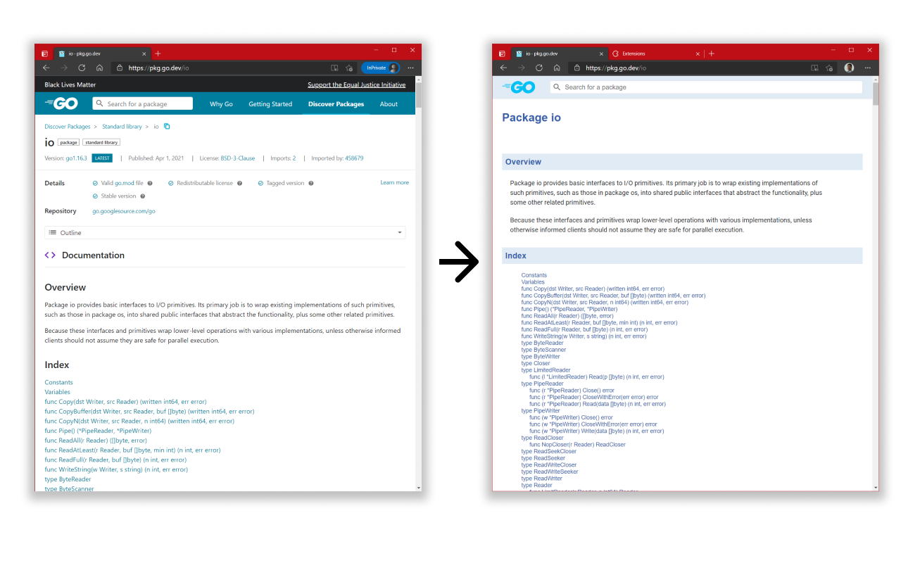

# Long live to godoc

If godoc.org was your main website during hours, you might miss its concise and clear format. This extension makes pkg.go.dev looks like godoc.org.

## Install

* [Chrome Extensions](https://chrome.google.com/webstore/detail/long-live-to-godoc/pmcnlcpfgagledkbdfbpfgjdneggbick)

## Why?

I prefer the old style.

## How?

Chrome extension that injects one css file (hand and ugly crafted) on the sites `pkg.go.dev` and `beta.pkg.go.dev`

## Who?

My name is Guillermo, and I am a golang contractor currently available.

## Did you remove the black lives matters?

Yes. But for the use of this extension, you acknowledge the support of the movement.

## It fails in XXX

Open an issue.

## How to develop

I run `go run main.go` from this repo and use this chrome extension [https://chrome.google.com/webstore/detail/witchcraft-jscss-injector/hokcepcfcicnhalinladgknhaljndhpc?hl=en](Witchcraft: JS/CSS injector). Edit the file and update the css file.

## Privacy Policy

The extension respects your privacy. It does not collect any information.
